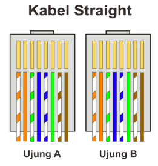
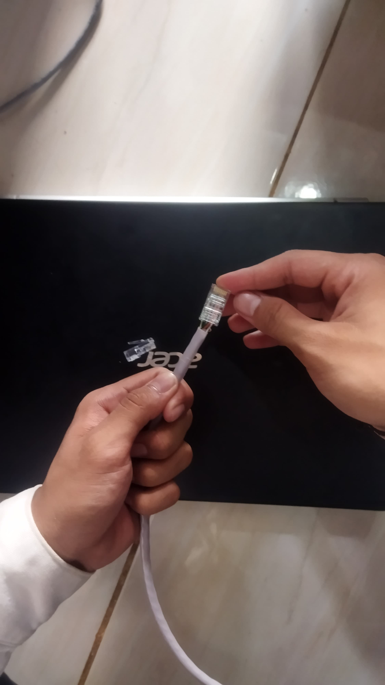
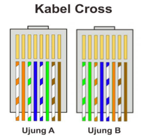

📌Laporan Praktikum 1 Jaringan Komputer

Nama : M. Rizky Taufik Nur Hidayat

NIM  : 09030582327076

Kelas: TK4B

<h1 style="font-weight: bold;">
  JUDUL PERCOBAAN
</h1 >

<h2>Membuat / griping Kabel Straight dan cross</h2>

<h3> Alat dan Bahan </h3> 
<h4>Kabel UTP</h4>
 
 

 
 <h4>Konektor RJ454</h4>
 
 
 
 
 <h4>Crimping Tool</h4>
 
 

 
 <h4>LAN Cable Tester</h4>
 
 

<h2>Hasil Percobaan</h2>

Pada percobaan ini, dilakukan proses pembuatan dan pengujian kabel jaringan menggunakan dua jenis
teknik pengkabelan, yaitu Straight dan Crossoverdengan konektor RJ45. Kabel yang digunakan adalah
kabel UTP dan melakukan pengujian setelah dirangkai menggunakan LAN Tester.

<h3>Berikut adalah langkah-langkah untuk Perakitan kabel UTP</h3>

<ol>
  <li>Perakitan kabel straight</li>
  <ul>
  <li>Memotong kabel UTP sepanjang kurang lebih 25 cm</li>
  <li>Mengupas pelindung luar kabel sepanjang kurang lebih 4 cm</li>
   
  <li>Menyusun pasangan kabel sesuai standar Staright sebagai berikut. </li>
    
  <li>Memasukkan kabel ke konektor RJ45.</li>
    
   <li>Melakukan crimping menggunakan crimping tool.</li>
   <li>Menguji kabel menggunakan LAN Tester.</li>
  </ul>
   

  <li>Pembuatan kabel cross</li>
  <ul>
    <li>Langkah yang sama dengan kabel straight-through, namun dengan susunan warna
kabel yang berbeda pada salah satu ujungnya. Dengan Standar Cross sebagai berikut.</li>
     
  </ul>
   
  
<li>Pengujian Kabel.</li>
  <ul>
    <h3>straight cable</h3>
  

  <h3>cross cable</h3>
  
  
  </ul>
</ol>

Kabel UTP yang telah dirakit berhasil diuji menggunakan LAN Cable Tester dan menunjukkan hasil yang
baik, di mana seluruh jalur koneksi berfungsi dengan benar. Pada pengujian kabel dengan tipe Straight,
maka indicator lampu pada LAN Tester akan berjalan sesuai urutan Straight. Dan pada saat pengujian
kabel dengan tipe Cross, maka lampu indicator lampu pada LAN Tester akan hidup secara menyilang
sesuai dengan urutan warna kabel Cross Hal ini menandakan bahwa kabel siap digunakan untuk
keperluan jaringan komputer. 

<h2>Analisis Percobaan :</h2>
<h4>Tujuan</h4>
<ol>
  <li>Memahami pengkabelan Straight menggunakan kabel UTP dan RJ45.</li>
  <li>Memahami pengkabelan Crossover menggunakan kabel UTP dan RJ45.</li>
  <li>Memeriksa koneksi kabel Straight dengan menggunakan Kabel Tester.</li>
  <li>Memeriksa koneksi kabel Crossover dengan menggunakan Kabel Tester.</li>
</ol>

 

Dalam percobaan ini, dilakukan proses perakitan kabel jaringan menggunakan
kabel UTP dengan konektor RJ45 serta pengujian menggunakan LAN Cable Tester. Terdapat dua
metode penyusunan kabel yang digunakan, yaitu Straight dan Cross, yang masing-masing memiliki
fungsi berbeda dalam jaringan komputer.

<h3>Keberhasilan Proses Perakitan</h3>
<ul>
  <li>Selama perakitan, digunakan Crimping Tool untuk menjepit konektor RJ45 ke kabel UTP</li>
  <li>Kesalahan dalam penyusunan kabel dapat menyebabkan jaringan tidak berfungsi, sehingga
ketelitian dalam pemasangan sangat penting.</li>
  <li>Dengan hasil pengujian yang menunjukkan koneksi berfungsi dengan baik, dapat disimpulkan
bahwa proses pemasangan konektor dan penyusunan kabel telah dilakukan dengan benar.</li>
</ul>

<h3>Fungsi Teknik Pengkabelan</h3>
<ul>
  <li>Kabel Straight digunakan untuk menghubungkan perangkat yang berbeda, seperti
komputer ke switch atau router ke modem</li>
  <li>Kabel Cross digunakan untuk menghubungkan perangkat sejenis, seperti komputer ke
komputer atau switch ke switch tanpa memerlukan port khusus (uplink).</li>
</ul>

<h2>Kesimpulan :</h2>

Berdasarkan hasil analisis percobaan, dapat disimpulkan bahwa proses perakitan kabel jaringan
menggunakan kabel UTP dan konektor RJ45 berhasil dilakukan dengan baik. Keberhasilan ini
ditunjukkan dengan hasil uji menggunakan LAN Tester, yang menunjukkan bahwa seluruh jalur
koneksi berfungsi dengan benar. Pengujian menggunakan LAN Tester penting untuk memastikan
koneksi telah sesuai sebelum kabel digunakan dalam instalasi jaringan.

 

Selain itu, pemahaman mengenai perbedaan antara kabel Straight dan Cross sangat penting dalam
konfigurasi jaringan. Kabel Straight digunakan untuk menghubungkan perangkat berbeda seperti
komputer ke switch atau router ke modem, sedangkan kabel Cross digunakan untuk
menghubungkan perangkat sejenis seperti komputer ke komputer atau switch ke switch.

 
 
